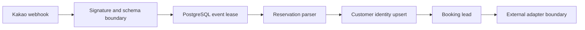

# Travel AI Automation Platform

[](https://github.com/cstion-ai/cstion/actions/workflows/ci.yml)
[](https://github.com/cstion-ai/cstion/actions/workflows/codeql.yml)
[](LICENSE)

An Apache-2.0 TypeScript and PostgreSQL reference implementation for converting Kakao travel inquiries into CRM customer records and booking leads.

> 한국어 요약: 카카오톡 여행 문의를 CRM 고객 기록과 예약 리드로 변환하는 TypeScript/PostgreSQL 예제입니다. 현재 파서는 규칙 기반이며, 실제 CRM·Google Sheets·WeChat 연동은 아직 구현되지 않았습니다.

[Explore the project page](https://cstion-ai.github.io/cstion/) · [Open in Codespaces](https://codespaces.new/cstion-ai/cstion) · [Use this template](https://github.com/new?template_name=cstion&template_owner=cstion-ai)

## Current status

The package is version 0.1.3 and is not production-ready. “Implemented” means the code and repository tests exist; it does not mean the capability has passed production or live-service validation.

| Capability | Status |
| --- | --- |
| Kakao message normalization and deterministic reservation parsing | Implemented and unit-tested |
| Install-free browser sandbox | Runs the production parser locally with synthetic text and no network request |
| Versioned offline reservation evaluation | 10-case regression baseline plus a frozen 48-case Korean-domain challenge with typed validation and CI enforcement |
| HMAC-authenticated Kakao webhook with a 256 KiB limit | Implemented and tested |
| PostgreSQL event, customer identity, and booking repositories | Implemented with unit tests and a PostgreSQL 16 CI integration suite |
| Crash recovery with processing leases and token fencing | Implemented; restart and concurrency paths run against PostgreSQL 16 in CI |
| Recorded database migration for existing installations | Implemented; a legacy-schema upgrade runs against PostgreSQL 16 in CI |
| HMAC-protected Kakao OAuth state and typed token-exchange errors | Implemented and unit-tested |
| Real CRM and Google Sheets adapters | Not implemented; interfaces and fakes only |
| Production deployment | Runtime startup is blocked while the adapters are fake |
| WeChat adapter and optional model-assisted extraction | Not implemented |

The current parser is deterministic and rule based. Documentation that mentions model-assisted extraction describes the roadmap, not an active runtime dependency.

This branch prepares `v0.1.3`; the current public release remains
[`v0.1.2`](https://github.com/cstion-ai/cstion/releases/tag/v0.1.2) until the
tag-triggered release gate completes.
Its exact commit, release gate, database job, and claim boundaries are indexed
in the [public evidence snapshot](docs/public-evidence.md).

## Implemented safeguards

- PostgreSQL channel events are unique by `channel` and `providerEventId`.
- Provider event and user identifiers are required and limited to 255 characters at the message boundary.
- Failed events and processing leases older than five minutes may restart with a new token; the token is required to complete or fail the event.
- Booking inserts use stable IDs and return the existing row on conflict.
- PostgreSQL customer upserts acquire identity locks in deterministic order and abort if the supplied identities have multiple owners.
- When `KAKAO_WEBHOOK_SECRET` is set, the webhook signature is verified before JSON parsing or pipeline work. Production configuration requires the secret.
- Kakao OAuth stores only an HMAC-derived check in the HttpOnly state cookie; the random state value itself is not stored in the browser cookie.
- The shared logging helper masks email addresses, phone numbers, and values stored under credential, token, secret, and password keys.
- The migration runner records applied migrations and runs them in a transaction under an advisory lock.
- CI includes unimported executable TypeScript source in the coverage denominator and enforces minimums of 90% lines, 80% branches, and 85% functions.
- Production configuration requires HTTPS endpoints and the documented secrets. The runtime refuses production startup while the CRM and Sheets adapters are fake.

See the [threat model](docs/threat-model.md) for trust boundaries and remaining risks.

## Quick start

Try the deterministic parser in the [browser sandbox](https://cstion-ai.github.io/cstion/#sandbox) without installing anything. It runs locally in the page, accepts synthetic text only, and does not test PostgreSQL or a real CRM connection.

Requirements:

- Node.js 22

Run one synthetic inquiry through the in-memory reference pipeline:

```bash
git clone https://github.com/cstion-ai/cstion.git
cd cstion
npm ci
npm run demo
```

The command needs no Kakao account or API key and prints a redacted result. It uses fake external adapters and is not a production connectivity test.

Run the versioned parser baseline and receive a machine-readable report:

```bash
npm run --silent evaluate:parser
```

The checked-in v1 set contains ten synthetic Korean cases. A perfect result
shows regression stability on those cases only; it is not a general accuracy
claim. See the [evaluation guide](evaluation/README.md) for metrics, privacy
rules, and custom fixture usage.

Run the frozen challenge and verify that its honest known-failure baseline has
not changed:

```bash
npm run --silent evaluate:challenge
```

The 48 maintainer-authored cases cover eight Korean-domain categories and use
the production confirmation decision. The command exposes current limitations;
it is not a holdout score, multilingual claim, or evidence of adoption.

To run every local quality gate and start the development HTTP server:

```bash
npm run check:all
npm run dev:server
```

The development server binds to `127.0.0.1` and uses in-memory repositories when `DATABASE_URL` is absent. Set `HOST` explicitly only when another network namespace, such as Docker, must reach it. The in-memory mode is for local exploration only.

To use PostgreSQL, copy `.env.example` to `.env`, replace the placeholder password, and start the development stack:

```bash
docker compose --env-file .env -f docker/docker-compose.yml up --build
```

The Compose stack runs the recorded migration before starting the app. Never commit `.env` or real customer data.

## API surface

- `GET /health` — service health
- `GET /auth/kakao/login` — Kakao authorization URL and protected state cookie
- `GET /auth/kakao/callback` — state validation and authorization-code exchange
- `POST /webhooks/kakao` — authenticated message-to-booking pipeline

When `KAKAO_WEBHOOK_SECRET` is configured, webhook clients must send:

```text
x-kakao-signature: sha256=<HMAC-SHA256 of the raw request body>
```

Invalid signatures return `401`, invalid payloads return `400`, and bodies larger than 256 KiB return `413`.

## Architecture



The PostgreSQL-backed runtime stores webhook idempotency and customer identity state in PostgreSQL. Redis is included in the development stack but is not used for correctness.

## Project documentation

- [Architecture](docs/architecture.md)
- [Data flow](docs/data-flow.md)
- [Threat model](docs/threat-model.md)
- [Roadmap](docs/roadmap.md)
- [Maintainer guide](docs/maintainer-guide.md)
- [PostgreSQL verification](docs/postgresql-verification.md)
- [Public evidence snapshot](docs/public-evidence.md)
- [Reservation evaluation baseline](evaluation/README.md)
- [Public project-page design contract](DESIGN.md)
- [Adoption evidence policy](ADOPTERS.md)
- [Community launch kit](docs/community-launch-kit.md)
- [Cloud deployment guardrails](cloud/README.md)
- [Docker development stack](docker/README.md)
- [Changelog](CHANGELOG.md)

## Evaluate and adopt

The repository is a template and includes a Node.js 22 dev container. You can create an independent copy with [Use this template](https://github.com/new?template_name=cstion&template_owner=cstion-ai), or open the source directly in [GitHub Codespaces](https://codespaces.new/cstion-ai/cstion).

If you evaluate, prototype, or deploy any part of the project, share the outcome through the [Show and tell form](https://github.com/cstion-ai/cstion/discussions/categories/show-and-tell). Reports are listed only with explicit permission. Stars, forks, clones, and page views are not counted as adopters; see [ADOPTERS.md](ADOPTERS.md).

## Contributing

Issues, discussions, and focused pull requests are welcome. Start with [CONTRIBUTING.md](CONTRIBUTING.md), follow the [Code of Conduct](CODE_OF_CONDUCT.md), and report vulnerabilities through the private process in [SECURITY.md](SECURITY.md).

The project uses a primary-maintainer model described in [GOVERNANCE.md](GOVERNANCE.md). Support expectations are in [SUPPORT.md](SUPPORT.md).

Maintainers should follow the [review and release checklist](docs/maintainer-guide.md).
Version tags are published only after the release workflow validates the tag,
package version, changelog section, full quality gate, and main-branch ancestry.

## Codex and OpenAI transparency

Codex has been used for code review and maintenance on this repository. Maintainers reproduce findings and require tests before accepting them; model output is not treated as evidence.

If OpenAI API credits are awarded, they will extend the checked-in synthetic
baseline through the offline typed evaluation interface and support maintainer
workflows. No runtime model path exists. Real customer messages, credentials,
and access tokens must not be sent to models.

The [draft application](docs/codex-for-oss-application.md) and
[public evidence snapshot](docs/public-evidence.md) keep program wording
separate from reproducible repository evidence.

## License

Licensed under the [Apache License 2.0](LICENSE).
