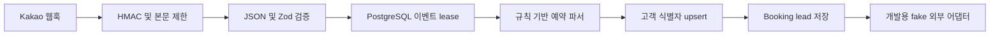

# 데이터 흐름

## 현재 구현

1. **HTTP 경계**: `POST /webhooks/kakao`가 원문 body의 HMAC-SHA256 서명을 확인하고 본문을 256 KiB로 제한합니다. 개발 환경에서만 secret 없이 unsigned 요청을 허용합니다.
2. **입력 검증**: 서명을 통과한 JSON을 `KakaoMessageSchema`로 검증합니다.
3. **이벤트 lease**: PostgreSQL이 `channel/providerEventId`를 고유하게 저장합니다. 실패 이벤트와 5분 넘게 멈춘 작업은 새 token으로 재처리할 수 있습니다.
4. **예약 정보 추출**: 규칙 기반 파서가 목적지, 날짜, 인원, 상품명, 이메일, 전화번호를 추출합니다. 런타임 LLM 경로는 없습니다.
5. **고객 upsert**: 채널 ID, 전화번호, 이메일 식별자를 기준으로 고객을 찾거나 생성합니다. PostgreSQL 구현은 identity lock과 소유권 충돌 검사를 수행합니다.
6. **Booking lead**: 필수 필드와 날짜가 유효할 때 stable ID로 리드를 저장합니다. 확정 예약, 결제, 취소, 환불은 구현되지 않았습니다.
7. **외부 어댑터**: 개발 환경의 CRM과 Sheets 어댑터는 메모리 fake입니다. 실제 연동이 없으므로 운영 시작은 차단됩니다.

## MVP API 경계

- `GET /health`: 클라우드 헬스 체크와 배포 검증에 사용합니다.
- `GET /auth/kakao/login`: Kakao REST API 키와 Redirect URI를 사용해 로그인 URL을 생성합니다.
- `GET /auth/kakao/callback`: 상태 쿠키를 검증하고 인가 코드를 토큰으로 교환합니다. 사용자 프로필 조회나 CRM 연결은 수행하지 않습니다.
- `POST /webhooks/kakao`: 메시지를 `ReservationIntent`로 파싱하고 CRM/Booking 결과를 JSON으로 반환합니다.

## P0 처리 결과

- `created`: idempotency 시작 성공, 필수 예약 정보 검증 성공, Booking lead 생성 및 개발용 fake adapters 호출 완료.
- `duplicate`: PostgreSQL unique constraint 기준 동일 `channel/providerEventId`가 이미 처리 중이거나 처리 완료됨.
- `needs_confirmation`: 날짜, 인원, 상품, 목적지 누락 또는 잘못된 날짜로 Booking lead 생성이 차단됨.
- `failed`: 외부 동기화나 저장 오류 분류를 기록합니다. 같은 이벤트가 다시 들어오면 `failed` 상태를 재처리합니다. 서버가 강제 종료된 경우에는 5분 넘게 멈춘 processing lease를 새 token으로 인계하며, 기존 Booking lead ID는 중복 생성하지 않습니다.

## 계획된 경로

WeChat webhook, 실제 CRM·Google Sheets 연동, Codex 런타임 작업, 모델 기반 예약 정보 추출은 구현되지 않았습니다. 운영 전 조건과 검증 증거는 [로드맵](roadmap.md)에 정의합니다.
