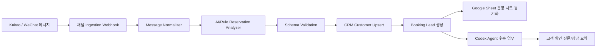

# 데이터 흐름도

## 단계별 정의

1. **Ingestion**: 카카오/위챗 웹훅에서 원문 메시지, 발신자 ID, 수신 시각, 프로필을 수집합니다.
2. **Normalize**: 채널별 payload를 공통 `KakaoMessage` 또는 `ChannelMessage` 형태로 변환합니다.
3. **Analyze**: 규칙 기반 파서와 LLM을 조합해 여행지, 날짜, 인원, 고객명, 연락처를 추출합니다.
4. **Validate**: Zod schema로 필수 필드와 날짜 포맷을 검증하고 신뢰도를 계산합니다.
5. **CRM Upsert**: 전화번호/이메일/채널 ID 기준으로 고객을 생성하거나 갱신합니다.
6. **Booking Lead**: 분석 결과를 예약 리드로 저장하고 상태를 `lead` 또는 `quoted`로 지정합니다.
7. **Sheet Sync**: 운영팀 견적·정산 시트에 예약 리드 행을 추가합니다.
8. **Agent Action**: 누락 필드가 있으면 자동 질문을 생성하고, 상담 요약과 할 일을 CRM에 남깁니다.
