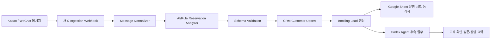

# 데이터 흐름도

## 단계별 정의

1. **Ingestion**: 카카오/위챗 웹훅에서 원문 메시지, 발신자 ID, 수신 시각, 프로필을 수집합니다. MVP 서버는 `POST /webhooks/kakao`로 카카오 메시지를 받습니다.
2. **Normalize**: 채널별 payload를 공통 `KakaoMessage` 또는 `ChannelMessage` 형태로 변환합니다.
3. **Analyze**: 규칙 기반 파서와 LLM을 조합해 여행지, 날짜, 인원, 고객명, 연락처를 추출합니다.
4. **Validate**: Zod schema로 필수 필드와 날짜 포맷을 검증하고 신뢰도를 계산합니다.
5. **CRM Upsert**: 전화번호/이메일/채널 ID 기준으로 고객을 생성하거나 갱신합니다.
6. **Booking Lead**: 분석 결과를 예약 리드로 저장하고 상태를 `lead` 또는 `quoted`로 지정합니다.
7. **Sheet Sync**: 운영팀 견적·정산 시트에 예약 리드 행을 추가합니다.
8. **Agent Action**: 누락 필드가 있으면 자동 질문을 생성하고, 상담 요약과 할 일을 CRM에 남깁니다.

## MVP API 경계

- `GET /health`: 클라우드 헬스 체크와 배포 검증에 사용합니다.
- `GET /auth/kakao/login`: Kakao REST API 키와 Redirect URI를 사용해 로그인 URL을 생성합니다.
- `GET /auth/kakao/callback`: 인가 코드를 토큰으로 교환한 뒤 CRM 고객 식별 플로우로 넘깁니다.
- `POST /webhooks/kakao`: 메시지를 `ReservationIntent`로 파싱하고 CRM/Booking 결과를 JSON으로 반환합니다.

## P0 처리 결과

- `created`: idempotency insert 성공, 필수 예약 정보 검증 성공, Booking lead 생성 및 fake adapters 동기화 완료.
- `duplicate`: PostgreSQL unique constraint 기준 동일 `channel/providerEventId`가 이미 처리 중이거나 처리 완료됨.
- `needs_confirmation`: 날짜, 인원, 상품, 목적지 누락 또는 잘못된 날짜로 Booking lead 생성이 차단됨.
