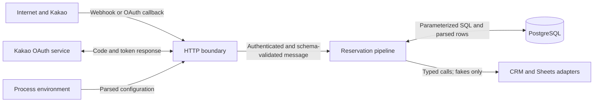

# Threat Model

## Scope and assumptions

This document covers the Kakao HTTP and OAuth boundaries, deterministic reservation pipeline, PostgreSQL repositories and migration runner, and the CRM and Google Sheets adapter boundary. The CRM and Sheets adapters are fakes, model-assisted extraction is inactive, and the runtime rejects production startup.

## Protected assets

- Customer identity links, contact details, and raw inquiry content
- Booking intent, reservation records, and event-processing state
- Kakao OAuth credentials, authorization codes, and access or refresh tokens
- Webhook signing and database credentials

## Trust boundaries

The HTTP boundary authenticates a webhook before parsing its JSON. Zod schemas validate webhook data, configuration, OAuth responses, and customer or booking rows that enter typed application code. Database constraints and transactions, rather than parsing alone, enforce uniqueness and ownership invariants.

## Implemented controls and remaining debt

| Threat | Enforced now | Known gap |
| --- | --- | --- |
| Forged webhook | The [HTTP server](../src/server/http-server.ts) verifies HMAC-SHA256 over the raw body, validates the signature encoding, and uses a timing-safe comparison before JSON parsing. Missing secrets fail closed outside development. | Development permits unsigned webhooks when no secret is configured and must not be exposed to untrusted traffic. |
| Resource exhaustion or malformed input | Webhook bodies are limited to 256 KiB, then JSON- and schema-parsed. Invalid HTTP request targets return `400` instead of escaping the request boundary. Development binds to loopback unless `HOST` is explicitly set. | No request-rate or connection limit is implemented; a deployment edge must provide them. |
| Duplicate delivery or worker takeover | PostgreSQL uniquely keys channel events, retries failed or five-minute-stale work with a random lease token, fences event status updates by that token, and keeps booking IDs unique. | Lease fencing does not cancel or deduplicate CRM or Sheets side effects. Before real adapters are enabled, add downstream idempotency, cancellation, and either lease renewal or an outbox. |
| Customer identity race or cross-customer merge | The [customer repository](../src/repositories/postgres-customer-repository.ts) takes identity advisory locks in deterministic order, reads every existing owner, and aborts on multiple owners. The schema makes each identity unique. Concurrent same-identity upserts run against PostgreSQL 16 in CI. | Recovery of a legacy multi-owner conflict is not automated against PostgreSQL, and no maintainer recovery runbook exists. |
| Sensitive logging | Current failure paths use [recursive redaction](../src/platform/redaction.ts) for email addresses, phone-like strings, secret-named fields, and `Error` messages. | Redaction is regex-based and does not cover names, provider user IDs, UUIDs, or arbitrary raw text. There is no centralized safe logger or production retention policy. |
| OAuth login CSRF, excess consent, or token disclosure | Login uses random state in an HttpOnly, SameSite=Lax, ten-minute cookie; production adds `Secure`, callback comparison is timing-safe, and the callback clears the cookie. It does not request additional personal-information scopes for unimplemented profile features. Token exchange has a five-second abort timeout and schema validation, and the HTTP response omits access and refresh tokens. | Cookie state is not server-side or replay-tracked. Replace it with an atomic, one-time TTL store before production use. |
| Unsafe configuration or incomplete adapters | Production configuration requires secrets, database persistence, and HTTPS CRM and redirect URLs. The [runtime](../src/server/runtime.ts) rejects production startup while only fake CRM and Sheets adapters exist. | TLS termination, secret storage and rotation, adapter retries, cancellation, downstream idempotency, and integration tests are outside the current implementation. |
| Migration collision or ambiguous legacy identity | The [migration runner](../src/repositories/migrate.ts) uses a transaction, advisory lock, and migration record; the migration aborts rather than merge identities owned by different customers. A nullable-provider legacy schema is upgraded against PostgreSQL 16 in CI. | Backup, restore, rollback, conflicting-owner recovery, and concurrent migration rehearsals remain required. |

## Model and automation privacy

No runtime path currently sends data to a model. Any future model-assisted extraction must:

- use synthetic or explicitly de-identified evaluation fixtures;
- omit access tokens, credentials, raw customer identifiers, and private conversations;
- define retention and regional-processing requirements before production use;
- validate model output with a typed schema;
- fall back to `needs_confirmation` when required fields are uncertain;
- record evaluation results without storing raw private conversations.

## Verification limits

The repository defines:

- unit and HTTP tests for signature rejection, body limits, OAuth state behavior, deterministic pipeline outcomes, lease-token behavior, identity conflicts, and redaction;
- strict TypeScript checks for source and tests, a build, migration-asset comparison, and a high-severity dependency audit in [CI](../.github/workflows/ci.yml);
- separate [dependency review](../.github/workflows/dependency-review.yml) and [CodeQL](../.github/workflows/codeql.yml) workflows.

These checks do not establish production readiness. The [PostgreSQL verification suite](postgresql-verification.md) covers a bounded set of migration, concurrency, retry, and idempotency scenarios against PostgreSQL 16. It does not cover backup and restore, migration rollback, operator recovery, or sustained load. There are no real CRM or Sheets integration tests, and repository tests do not verify edge TLS, rate limiting, secret management, log retention, or model-provider privacy. Workflow presence also does not prove that a particular commit passed remotely.
